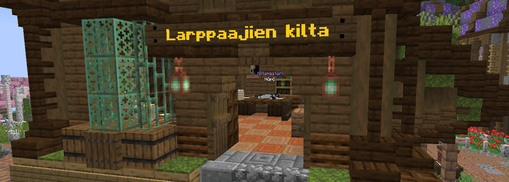
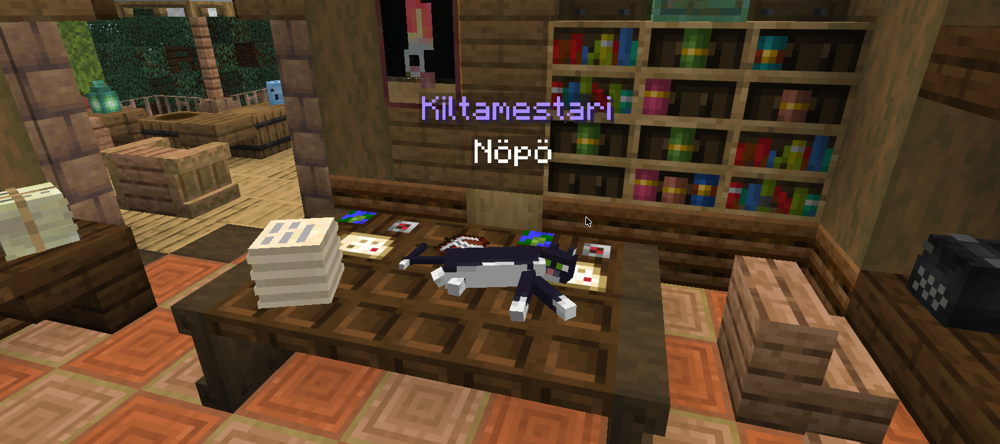
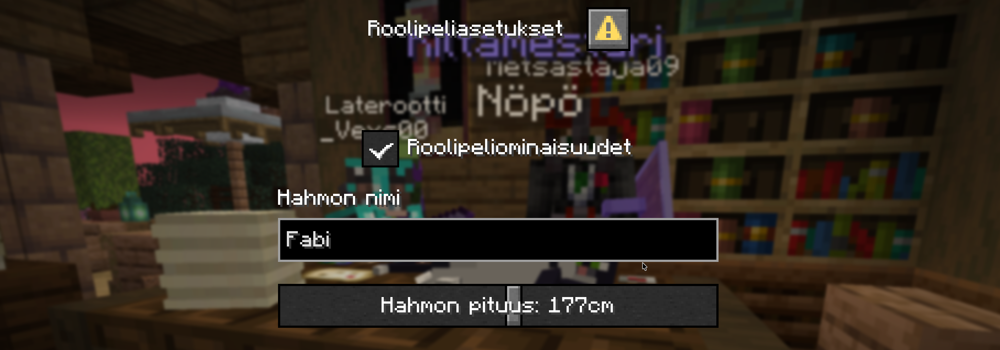
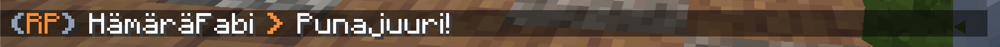

**Larppaajien kilta** spawnilla on keskitetty paikka säätää kaikkia roolipeliasetuksia.
Saat roolipeliasetukset näkyviin puhumalla kiltamestarille.

Asetuksista saat otettua roolipeliominaisuudet käyttöön ja vaihdettua oman hahmon nimeä ja pituutta.
Hahmon nimi on käytössä roolipelichatissa.

Roolipeliominaisuudet voi myös ottaa käyttöön / postaa käytöstä milloin tahansa komennolla `/rp`.

## Roolipelichat
Roolipelichat näkyy **100 palikan säteellä** oleville pelaajille, jos he ovat ottaneet itselleen roolipelauksen käyttöön.
Kirjoitus chattiin onnistuu komennolla `/rpchat <viesti>`.

